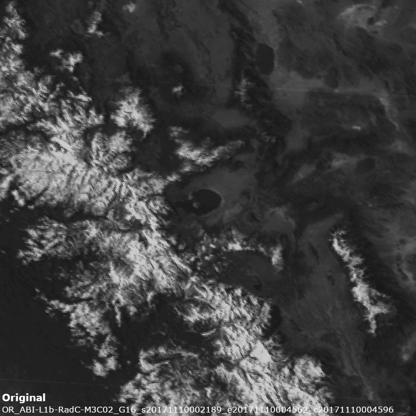
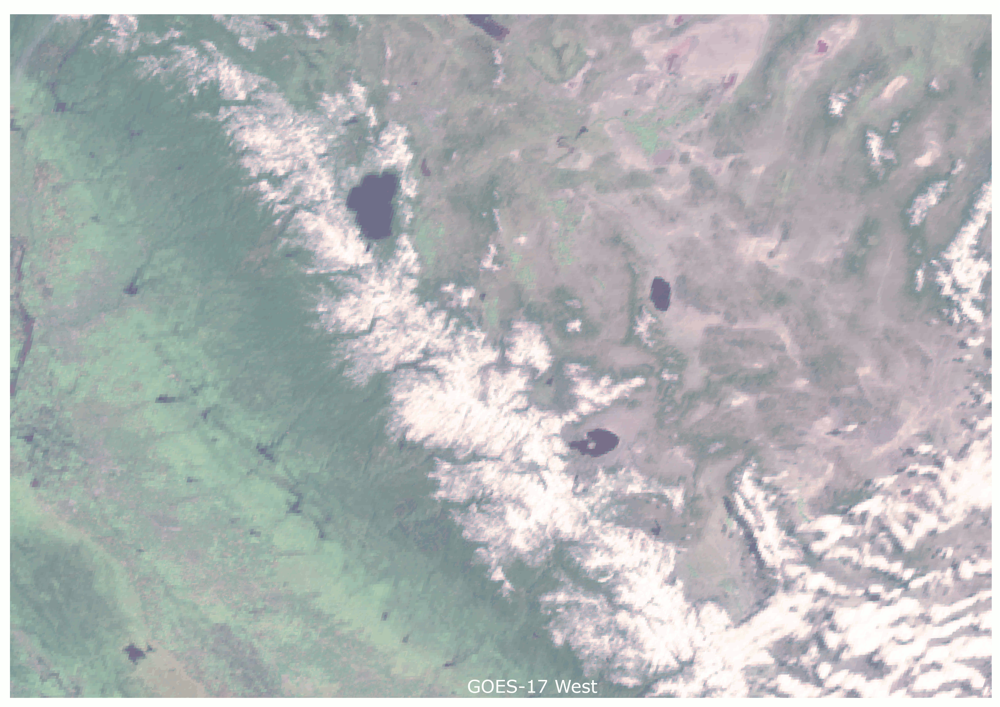
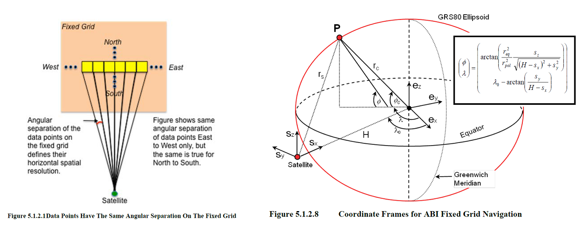
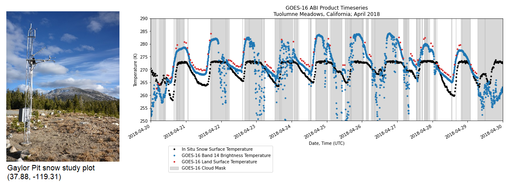
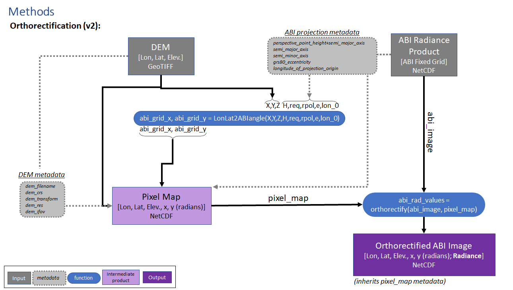

GOES ABI Terrain Correction
===========================

.. image:: https://zenodo.org/badge/281728618.svg
   :target: https://zenodo.org/badge/latestdoi/281728618
   :alt: DOI

.. image:: https://github.com/spestana/goes-ortho/actions/workflows/tests.yml/badge.svg
   :target: https://github.com/spestana/goes-ortho/actions/workflows/tests.yml
   :alt: tests

.. image:: https://github.com/spestana/goes-ortho/actions/workflows/build-docs.yml/badge.svg
   :target: https://github.com/spestana/goes-ortho/actions/workflows/build-docs.yml
   :alt: docs

.. image:: https://img.shields.io/conda/vn/conda-forge/goes-ortho.svg
   :target: https://anaconda.org/conda-forge/goes-ortho
   :alt: conda-forge

.. image:: https://img.shields.io/pypi/v/goes-ortho.svg
   :target: https://pypi.python.org/pypi/goes-ortho
   :alt: pypi

Orthorectifying GOES ABI imagery at sub-pixel resolution

----

The latest generation of geostationary-orbiting weather satellites make frequent observations (5-60 min) in the visible and IR wavelengths at moderate resolutions (500-~2000m) (GOES-16/17 ABI, Himawari 8/9 AHI). This lends themselves to be used to fill temporal gaps between ~12-hour repeat observations by polar-orbiting spacecraft (Aqua/Terra MODIS, SNPP VIIRS, etc).
However, their geostationary orbits mean that outside of their sub-satellite-point on the equator, all other view angles are off-nadir, and due to the Earth's curvature in view, actual pixel sizes increase to >6 km towards the planet's limb.

Additionally, when viewing complex terrain such as the mountains of western CONUS, parallax affects the apparent position of the variable topography. Some portions of the ground surface may even become obscured from view completely by surrounding steep terrain with poleward-facing aspects (north-facing aspects in the Northern Hemisphere, south-facing aspects in the Southern Hemisphere).

Before using observations from these instruments for observing the land surface over mountains, orthorectification is needed to try and account for the off-nadir view angles and topographic effects in the geostationary satellite imagery.

The terrain parallax is especially visually apparent when flipping between GOES-East and GOES-West views of a mountain range like the Sierra Nevada here:

The sub-pixel orthorectification method applied here uses the GOES satellite's known orbital position (from ABI product NetCDF metadata) to compute the intersection of line of sight (LOS) vectors with a DEM surface. This method is **"sub-pixel"** because the DEM spatial resolution can be much finer (here I've used ~30 m, 1 arc-second SRTM DEM) than the GOES ABI image resolution (> 2 km). This effectively drapes ABI pixels (and their respective radiance or brightness temperature values) over the terrain at the DEM's finer resolution.

The figure below (from the GOES ABI ATBD) illustrates the satellite's viewing geometry. The orthorectification method developed here modifies point P on the Earth's surface using information from a DEM about its elevation relative to the reference ellipsoid.

These python scripts and jupyter notebooks help with downloading GOES ABI data from AWS (wrapper around the `goespy <https://github.com/palexandremello/goes-py>`_ library), creating timeseries of GOES ABI brightness temperature for point locations, and orthorectifying (terrain correction) GOES ABI imagery using a DEM (here specifically for part of the Sierra Nevada in California).

----

Setting up the environment
--------------------------

Using `conda <https://docs.conda.io/projects/conda/en/latest/index.html>`_ or `mamba <https://mamba.readthedocs.io/en/latest/>`_

.. code-block:: bash

   conda env create -f environment.yml
   conda activate goesenv
   pip install -e .
   ipython kernel install --user --name goesenv

Also currently requires `this version of goespy <https://github.com/spestana/goes-py>`_

.. code-block:: bash

   pip install git+https://github.com/spestana/goes-py#egg=goespy

----

download-goes.py
----------------

Downloads GOES-16 or GOES-17 products/bands, requires command line arguments (wrapper around ``goespy.Downloader.ABI_Downloader()``):

Usage:
~~~~~~

.. code-block:: bash

   python ./download-goes.py --bucket <S3-BUCKET> --year <YEAR> --month <MONTH> --days <START DAY> <END DAY> --product <ABI PRODUCT CODE> --channel <ABI CHANNEL> --bounds <MIN_LAT> <MAX_LAT> <MIN_LON> <MAX_LON> --dir <DESTINATION DIRECTORY>

Examples:
~~~~~~~~~

This will download the GOES-16 ABI Level-1b Radiance (CONUS) product for channel/band 14, for January 1-2 2020. The NetCDF files will be cropped to within latitudes 30 - 50 and longitudes -125 - -105, and saved in /storage/spestana/scratchspace.

.. code-block:: bash

   python ./download-goes.py --bucket noaa-goes16 --year 2020 --month 2 --days 1 2 --product ABI-L1b-RadC --channel C14 --bounds 30 50 -125 -105 --dir /storage/spestana/scratchspace

We can do the same command with short flag names:

.. code-block:: bash

   python ./download-goes.py -B noaa-goes16 -Y 2020 -M 1 -D 1 2 -p ABI-L1b-RadC -c C14 -b 30 50 -125 -105 -d /storage/spestana/scratchspace

----

goes_ortho.make_abi_timeseries()
--------------------------------

Creates a time series of a given GOES ABI product variable for a specified point location. This function can take into account the point's elevation (in meters) to correct for terrain parallax from off-nadir view angles of GOES.

Usage:
~~~~~~

.. code-block:: python

   df = make_abi_timeseries(directory, product, data_vars, lon, lat, elev, outfilepath)

**Inputs:**
 * ``directory``: Directory containing GOES ABI product NetCDF files (using glob, this function searches recursively and allows the use of `Unix shell-style wildcards <https://docs.python.org/3/library/glob.html>`_)
 * ``product``: GOES ABI product to search directory for (using glob, this allows the use of `Unix shell-style wildcards <https://docs.python.org/3/library/glob.html>`_)
 * ``data_vars``: String or list of strings, each the name of a data variable contained within the ABI product NetCDF file; If an ABI-L1b-Rad product is being read, and radiance ("Rad") is one of the data variables in this list, an additional column will be returned (`ref_or_tb`) containing reflectance (for ABI bands 1-6) or brightness temperature (for ABI bands 7-16) converted from the radiance values.
 * ``lon``: Longitude in degrees (-180 to 180)
 * ``lat``: Latitude in degrees (-90 to 90)
 * ``elev``: Elevation in meters (above GRS80 ellipsoid) of the point of interest
 * ``outfilepath``: Optional filepath and filename to output a csv file of the resulting pandas dataframe
**Returns:**
 * ``df``: Pandas dataframe where df.index is a pandas Timestamp of the GOES ABI observation time in UTC, and a column for each of the data_vars

Examples:
~~~~~~~~~

See `make_abi_timeseries_example.ipynb <docs/examples/make_abi_timeseries_example.ipynb>`_ jupyter notebook.

----

goes_ortho.orthorectify_abi() and goes_ortho.make_ortho_map()
~~~~~~~~~~~~~~~~~~~~~~~~~~~~~~~~~~~~~~~~~~~~~~~~~~~~~~~~~~~~~

Functions for orthorectifying GOES-R ABI imagery using a DEM. Produces an orthorectified NetCDF at the spatial resolution of the input DEM.

This method uses the GOES satellite's known orbital position (from ABI product NetCDF metadata) to compute the intersection of line of sight (LOS) vectors with a DEM surface.

Usage:
~~~~~~

.. code-block:: python

   # import to use these functions
   import goes_ortho

   # specify filepaths for inputs
   abi_filepath = (
       ".\OR_ABI-L1b-RadC-M4C14_G16_s20171111750224_e20171111755027_c20171111755074.nc"
   )
   dem_filepath = ".\dem.tif"

   # download DEM (make sure to convert to GRS80 ellipsoid model GOES ABI fixed grid uses)
   get_dem(
       demtype="SRTMGL3",
       bounds=(-121, 36, -118, 41),
       out_fn=dem_filepath,
       proj="+proj=lonlat +datum=GRS80",
   )

   # specify which data variables we want to include in the final product
   data_vars = ["Rad"]

   # generate the pixel mapping
   pixel_map = goes_ortho.make_ortho_map(abi_filepath, dem_filepath)

   # orthorectify the image
   goes_ortho.orthorectify_abi(
       abi_filepath, pixel_map, data_vars, out_filename="test_ortho.nc"
   )

Examples:
~~~~~~~~~

**Note:** I've also included a copy of `asp_binder_utils.py <https://github.com/uw-cryo/asp-binder-demo/blob/6f03afadc7f4c6e13422da6d5f480c7f6762b47b/asp_binder_utils.py>`_ here which has the extremely useful ``get_dem()`` function for downloading geotiffs of DEMs.

See the `orthorectify_abi_example.ipynb <https://github.com/spestana/goes-ortho/blob/main/examples/orthorectify_abi_example.ipynb>`_ notebook for an example of orthorectifying GOES-16 and -17 images to make a pair of RGB images.

See the `goes-orthorectify <https://github.com/spestana/goes-ortho/blob/main/goes-orthorectify.ipynb>`_ notebook for an example of orthorectifying a single GOES ABI image.

See the `goes-orthorectify-aster.py <https://github.com/spestana/goes-ortho/blob/main/goes-orthorectify-aster.py>`_ script for an example of orthorectifying a batch of GOES ABI images.

Flowchart:
~~~~~~~~~~

(flowchart diagram is a work in progress)

----

goes-timeseries.py
~~~~~~~~~~~~~~~~~~

**NOTE: Use ``goes_ortho.make_abi_timeseries()`` rather than this script.**

Creates a time series of GOES ABI radiance values for a specified point location. This takes into account the point's elevation (in meters) to correct for terrain parallax from off-nadir view angles of GOES.

Usage:
~~~~~~

.. code-block:: bash

   python ./goes-timeseries.py -d /storage/GOES/goes16/2017/03 -l <LATITUDE> <LONGITUDE> <ELEVATION>

Examples:
~~~~~~~~~

Gaylor Pit @ lat=37.88175, lon=-119.31212, elev=2811:

.. code-block:: bash

   python ./goes-timeseries.py -d /storage/GOES/goes16/2017/03 -l 37.88175 -119.31212 2811

Grand Mesa West @ lat=39.0339, lon=-108.2140, elev=3033:

.. code-block:: bash

   python ./goes-timeseries.py -d /storage/GOES/goes16/2017/03 -l 39.0339 -108.2140 3033

CUES site @  lat=37.643103, lon=-119.029146, elev=2940:

.. code-block:: bash

   python ./goes-timeseries.py -d /storage/GOES/goes16/2017/03 -l 37.643103 -119.029146 2940
